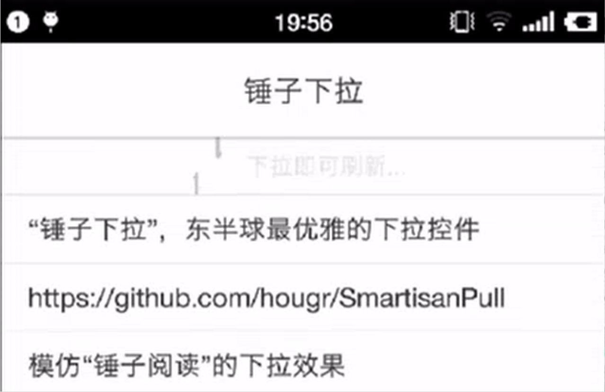
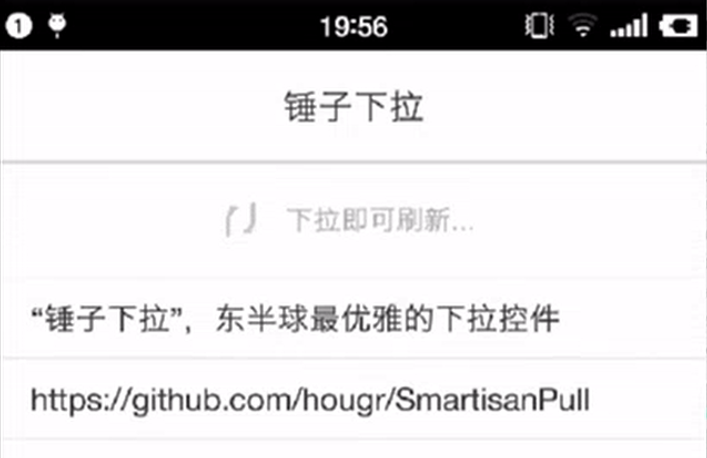

# 锤子下拉

“锤子下拉”，东半球最优雅的下拉控件。（也叫SmartisanRefreshableLayout。）


# 说明
本项目模仿“锤子阅读”的下拉效果。仅供学习交流，请勿用于商业用途。


# 介绍
下面是我做的过程中，每个阶段有意思的地方：
（下面把“可刷新”的最小距离叫刷新距离）


| 阶段           | 该阶段截图 | 该阶段说明 |
| --------------- | ------------------ | --------------- |
| 刚开始    |  |  下拉时先把item0上面的分隔线滚动出来，该分隔线在下拉过程中一直显示，直到header完全消失，它才重新藏起来。还有，到达刷新距离前，提示语逐渐清晰。另外，在任何阶段，如果手指向上返回，动画逐渐回到原始状态。 |
| 到达刷新距离前    |  |  两线段逐渐过渡为圆弧。 |
| 到达刷新距离时    |  |  两圆弧刚好各转半圈，两圆弧间的两个缺口处于同一水平线。 |
| 到达刷新距离以下    |  |  刷新距离以下，摩擦系数越来越大。但是，两圆弧的旋转始终是平滑的，只有速度变化。 |
| 刷新完成后    |  |  最后，两圆弧逐渐过渡成线段，消失在两端。 |

# 使用

### 首先，在布局文件中使用SmartisanRefreshableLayout

只需在里面加入ListView，仍然保持了ListView的正常使用，不会对它造成什么影响。

```
<com.hougr.smartisanpull.SmartisanRefreshableLayout
     android:id="@+id/refreshable_view"
     android:layout_width="fill_parent"
     android:layout_height="fill_parent" >

     <ListView
         android:id="@+id/list_view"
         android:layout_width="fill_parent"
         android:layout_height="fill_parent"
         android:background="#ffffff"
         android:scrollbars="none" >
     </ListView>
</com.hougr.smartisanpull.SmartisanRefreshableLayout>

```

### 然后，实现下拉事件的监听

```
mSmartisanRefreshableLayout = (SmartisanRefreshableLayout) findViewById(R.id.refreshable_view);
mSmartisanRefreshableLayout.setOnRefreshListener(new SmartisanRefreshableLayout.PullToRefreshListener() {
    @Override
    public void onRefresh() {
        try {
            Thread.sleep(1500);
        } catch (InterruptedException e) {
            e.printStackTrace();
        }
    }
            
    @Override
    public void onRefreshFinished() {
        mSmartisanRefreshableLayout.finishRefreshing();
        mViewHolderAdapter.addToListHead((mRefreshCount++)+" 喜欢的话，可以在github上赏我一颗star");
    }
});
        
```

# 拜托
喜欢的话，可以点击右上角的star。感谢。
